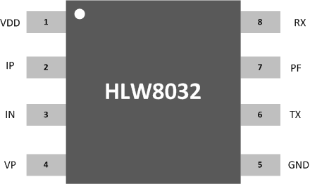
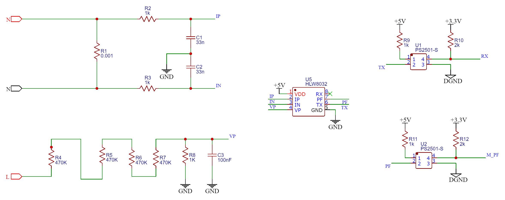

# HLW8032 Overview
The HLW8032 stands as a highly accurate energy measurement integrated circuit, crafted using CMOS technology, and is predominantly utilized in single-phase electrical systems. This IC is capable of measuring both the voltage and current of a line, and it adeptly computes the active power, apparent power, and power factor. Featuring two integrated ∑-Δ ADCs and a sophisticated energy metering core, the HLW8032 ensures precise data handling. It operates on a 5V power supply and is equipped with a 3.579M built-in crystal oscillator. Packaged in an 8PIN SOP format, the HLW8032 prides itself on its precision, low power usage, robust reliability, and adaptability to various environments. This makes it an ideal solution for single-phase two-wire power consumers’ energy measurement needs.

# Key Features
- Proficient in measuring active power, apparent power, voltage RMS, and current.
- Provides active energy pulse output through the PF pin.
- Achieves an active power measurement error of merely 0.2% within a dynamic range of 1000:1.
- Maintains an effective current measurement error of just 0.5% within the same dynamic range.
- Also, within this range, it manages an effective voltage measurement error of 0.5%.
- Incorporates a built-in frequency oscillator and voltage reference source.
- Features an internal power monitoring circuit.
- Employs UART for communication purposes.
- Comes in an SOP8 package format.

<h2> Pin Description </h2>

  

<h2> Application Schematic </h2>

  

